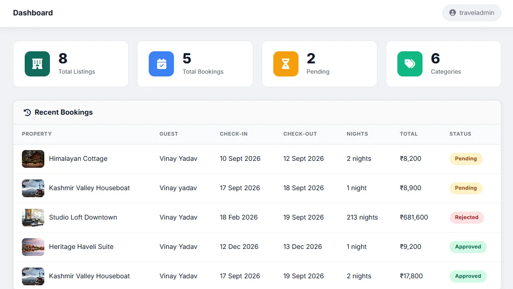

# TravelNest - Admin Panel

This is the admin panel of my TravelNest project (travel stay booking website).
Admin can login, add and manage places (listings), manage categories and approve or reject bookings done by users on the TravelNest user website.

**Live Link:** https://travelnest-admin.vercel.app

**User Website:** https://travelnest-user.vercel.app ([code](https://github.com/VinayYadav07/travelnest-user))



## Features

- Admin login using Firebase Authentication (REST API)
- Dashboard opens only after login, otherwise it goes to login page
- Sidebar with 4 sections: Overview, Categories, Listings, Bookings
- Overview shows total listings, total bookings, pending bookings and categories
- Add, edit and delete listings (place name, category, city, PIN code, price per night, images)
- Available on/off switch for every listing
- Add, edit and delete categories
- Approve or reject bookings, and user can see the status on their My Bookings page
- Filter bookings by All, Pending, Approved and Rejected
- Confirm message before deleting
- Success and error messages after every action
- All data is saved in Firebase Realtime Database using fetch (GET, POST, PATCH, DELETE)
- Sample data (6 listings and 5 categories) shows if database is empty

## Tech Used

- React.js
- JavaScript
- Vite
- React Router
- Bootstrap
- Firebase Authentication (REST API)
- Firebase Realtime Database (REST API)
- Fetch API
- CSS

## What I Learned

- How to make a separate admin panel for a project
- How to use REST API methods (GET, POST, PATCH, DELETE) with fetch
- How to protect pages in React Router if admin is not logged in
- How to update booking status from admin side and show it on user side
- How to deploy a React app on Vercel

## Problems I Faced

- When I refreshed the page on Vercel, it was showing 404 error. I added `vercel.json` file to fix the routing.
- Firebase gives data as object, not array. I made a function to change object into array to show data in table.
- Dashboard was opening without login. I added a check, so without login it goes to login page.

## Future Plans

- Add search for listings
- Upload images directly instead of image URL
- Send email to user when booking is approved or rejected

## How to Run

1. Clone the project

```bash
git clone https://github.com/VinayYadav07/travelnest-admin.git
cd travelnest-admin
```

2. Install packages

```bash
npm install
```

3. Make a `.env` file in the main folder and add your Firebase key

```
VITE_FIREBASE_KEY=your_firebase_api_key
```

4. Start the project

```bash
npm run dev
```

5. Open http://localhost:5173 in browser

## Made By

**Vinay Kumar Yadav**

- Portfolio: https://portfolio-rho-red-54.vercel.app
- LinkedIn: https://www.linkedin.com/in/vinay-yadav-593b53329
- GitHub: https://github.com/VinayYadav07
